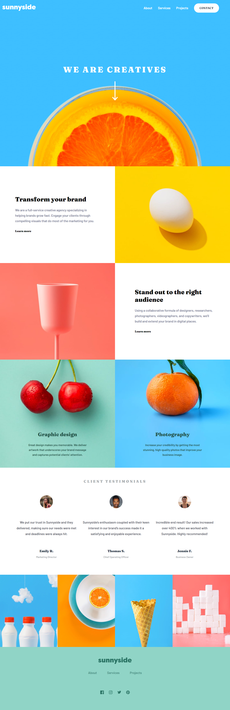

# Frontend Mentor - Sunnyside agency landing page solution

This is a solution to the [Sunnyside agency landing page challenge on Frontend Mentor](https://www.frontendmentor.io/challenges/sunnyside-agency-landing-page-7yVs3B6ef). Frontend Mentor challenges help you improve your coding skills by building realistic projects.

## Table of contents

- [Overview](#overview)
  - [The challenge](#the-challenge)
  - [Screenshot](#screenshot)
  - [Links](#links)
- [My process](#my-process)
  - [Built with](#built-with)
  - [What I learned](#what-i-learned)
- [Author](#author)

**Note: Delete this note and update the table of contents based on what sections you keep.**

## Overview

### The challenge

Users should be able to:

- View the optimal layout for the site depending on their device's screen size
- See hover states for all interactive elements on the page

### Screenshot



### Links

- Solution URL: [Add solution URL here](https://github.com/tvgc/sunnyside-agency-landing-page-main)
- Live Site URL: [Add live site URL here](https://your-live-site-url.com)

## My process

### Built with

- Semantic HTML5 markup
- CSS custom properties
- Flexbox
- CSS Grid
- Mobile-first workflow
- BEM
- SMACSS
- NAMESPACES


### What I learned

Project focused on applying the main CSS conventions, such as BEM, SMACSS, and NAMESPACES. It is responsive and prepared for any screen size.

See below some examples:

```html
<header class="l-header u-mobile-padding-inline"> <!--here I used NAMESPACES convention with "l-" (layout) and "u-"(utilities)-->
```

```css
/* BEM example */
.c-services__content {
    display: flex;
    flex-direction: column;
    justify-content: flex-end;
}
```

## Author

- Frontend Mentor - [@tvgc](https://www.frontendmentor.io/profile/tvgc)
